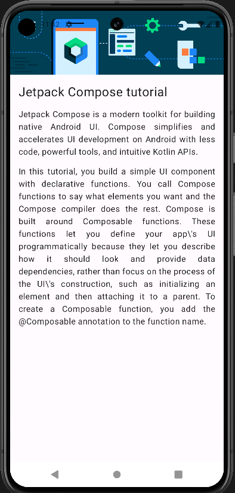

# Android Development Projects

This repository contains a collection of Android development projects built using Jetpack Compose. These projects serve as practical examples and exercises to enhance Android development skills with modern tools and techniques.

## Projects Included

### 1. **BirthdayCardApp**

- A simple app demonstrating how to create a custom birthday card using Jetpack Compose.

### 2. **ComposeQuadrantApp**

- An app that showcases the use of different layout composables like `Row`, `Column`, and `Box` to arrange UI elements in a quadrant.

### 3. **TaskManager**

- A task management app that illustrates how to handle state and display a list of tasks using Jetpack Compose.

### 4. **BusinesCardApp**

- A Business Card app that illustrates a persons virtual card containing their details and mode to contact.

## Technologies Used

- **Kotlin**: The primary programming language used.
- **Jetpack Compose**: The modern toolkit for building native UI in Android.

## Preview of few Apps

<table>
<tr> 
<td> </td>
<td> </td>
<td> </td>
</tr>
<tr> 
<td> </td>
<td> </td>
<td> </td>
</tr>
</table>

## Getting Started

To run these projects locally, clone the repository and open it in Android Studio. Ensure you have the latest stable version of Android Studio and the necessary Android SDKs installed.

```bash
git clone https://github.com/luccidx/Android-Development.git
```
